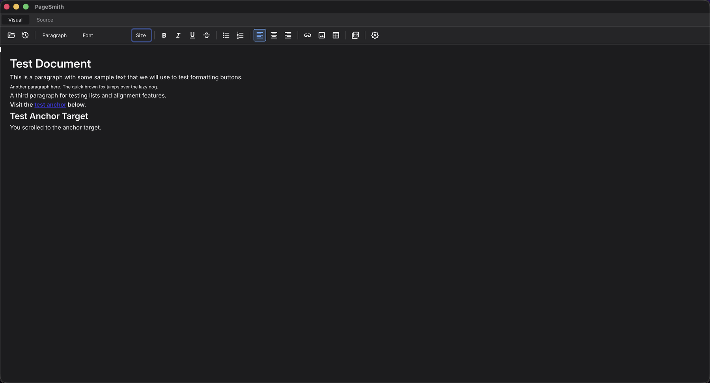

<div align="center">

# PageSmith

**A visual HTML editor for macOS — open any `.html` file, edit it like a Word document, save it back cleanly.**

[](https://github.com/UtkarshaKumar/pagesmith/releases/latest)
[](https://github.com/UtkarshaKumar/pagesmith/releases/latest)
[](https://tauri.app)



</div>

## About

PageSmith is what Microsoft Word is for `.docx` — but for `.html`. Open any HTML file on your Mac, edit content, tables, and styling visually, and save it back as standard HTML. No proprietary project format. No build step. No code panel unless you ask for one.

It's also designed as a refinement surface for LLM-generated HTML. When an assistant produces an `.html`, PageSmith lets you tweak it visually and gives the model surgical edit primitives (instead of asking it to regenerate the whole file).

## Why it exists

Every existing tool sits in one of three boxes:

| Category | Examples | Problem |
|---|---|---|
| Site builders | Webflow, Sparkle, Blocs | Proprietary project formats — can't open a hand-written `.html` |
| Code editors | VS Code, BBEdit, Nova | Code-first; not WYSIWYG |
| Rich-text SDKs | TinyMCE, CKEditor, Tiptap | Components for other apps, not standalone editors |

The "open a file, edit visually, save it back" desktop app died with BlueGriffon (2024). PageSmith brings it back, native to macOS.

## Features

- **Open any local `.html`** — no import, no conversion, no project file
- **Visual editing** — headings, paragraphs, bold/italic/underline/strike, lists, alignment, links, images, tables
- **Surgical round-trip** — `<head>`, comments, inline scripts, and untouched regions pass through verbatim on save
- **Visual ⇆ Source toggle** — switch between WYSIWYG and raw HTML at any time
- **Cmd+click navigation** — follow in-page anchors and relative file links without leaving the app
- **PDF export** — render the current document to PDF in one click
- **Light, dark, and auto themes** — follows your system preference by default
- **Native macOS feel** — ~10 MB binary, Finder file association, recent files, keyboard shortcuts

## Install

Apple Silicon only for now (`aarch64`). Intel build coming.

> **Already installed and seeing "PageSmith is damaged and can't be opened"?**
> Open Terminal and run this one line — it will fix the existing install:
>
> ```bash
> xattr -cr /Applications/PageSmith.app && open /Applications/PageSmith.app
> ```

### Option 1 — One-line install (recommended)

This downloads via `curl` (which doesn't set the macOS quarantine flag that confuses Gatekeeper), copies the app to `/Applications`, and launches it:

```bash
curl -sSL https://raw.githubusercontent.com/UtkarshaKumar/pagesmith/main/install.sh | bash
```

### Option 2 — Manual install from the DMG

1. Download the DMG from the [Releases](https://github.com/UtkarshaKumar/pagesmith/releases/latest) page
2. Open the DMG and drag `PageSmith.app` into `/Applications`
3. Open Terminal and run:

   ```bash
   xattr -cr /Applications/PageSmith.app && open /Applications/PageSmith.app
   ```

   That step is necessary because browsers (Safari/Chrome) tag downloads with a `com.apple.quarantine` extended attribute, and macOS Gatekeeper falsely reports unsigned apps with that attribute as "damaged."

### Why the extra step

The app is ad-hoc code-signed but not yet Apple-notarized (notarization requires a $99/year Apple Developer account, on the roadmap). On macOS Sequoia and later, Gatekeeper will refuse to launch any non-notarized app downloaded through a browser and falsely report it as "damaged." The `xattr -cr` command strips the quarantine flag and lets the app launch.

If you used the one-line installer above, you don't need to do this — `curl` doesn't set the quarantine flag in the first place.

### Managed / corporate Macs

If your Mac is managed by your employer (MDM), even stripping quarantine yourself may not be enough — corporate policy can block any application not on the IT allowlist. Ask your IT team to allow bundle identifier `com.pagesmith.app`.

## Keyboard shortcuts

| Action | Shortcut |
|---|---|
| Open file | `⌘O` |
| Save | `⌘S` |
| Save as | `⌘⇧S` |
| Bold | `⌘B` |
| Italic | `⌘I` |
| Underline | `⌘U` |
| Insert link | `⌘K` |
| Undo / Redo | `⌘Z` / `⌘⇧Z` |
| Toggle Visual / Source | `⌘⇧M` |
| Zoom in / out / reset | `⌘=` / `⌘-` / `⌘0` |
| Follow link in-app | `⌘`-click |

## Architecture

PageSmith is a hybrid Rust + web app built on [Tauri 2](https://tauri.app).

- **Shell** — Tauri 2 (native macOS window, file system access, file associations)
- **Editor surface** — Vanilla JavaScript on `contenteditable`, no framework
- **Source engine** — Rust, with `html5ever` for parsing
- **Source-of-truth model** — the raw HTML string plus an offset-keyed source map. Edits are recorded as `(offset, length, replacement)` patches against the original bytes; on save only changed regions are rewritten, so attribute order, whitespace, comments, and `<head>` content survive untouched

This is closer to how `rust-analyzer` does syntax-tree-preserving edits than how traditional WYSIWYG editors work.

## Building from source

### Prerequisites

- macOS 13+
- [Rust](https://rustup.rs/) (`rustup` toolchain, stable)
- Node.js 18+ and `npm`
- Xcode Command Line Tools

### Build

```bash
git clone https://github.com/UtkarshaKumar/pagesmith.git
cd pagesmith
npm install
npm run tauri -- build
```

The built `.app` and `.dmg` land in `src-tauri/target/release/bundle/`.

### Run in dev mode (with hot reload)

```bash
npm run tauri -- dev
```

### Run Rust tests

```bash
cd src-tauri && cargo test
```

The test suite covers ~70 round-trip scenarios across HTML5 semantics, forms, scripts, templates, comments, and whitespace edge cases.

## Project status

PageSmith is **active development**, currently at `v0.4.x`. Block-level editing (headings, lists, alignment), file I/O, undo/redo, and theming are stable. Image insertion, table editing, and PDF export work but may have rough edges. The web-trial build for non-Mac users is on the roadmap.

See [Releases](https://github.com/UtkarshaKumar/pagesmith/releases) for changelog.

## Roadmap

- [ ] Apple Silicon + Intel universal binary
- [ ] Notarized DMG for one-click install
- [ ] Web trial build (Chromium File System Access API)
- [ ] LLM tool surface (`replace_range`, `insert_before`, etc.) over a documented JSON-RPC layer
- [ ] Find / replace
- [ ] Drag-drop reordering of blocks
- [ ] Multi-file workspace

## Contributing

Issues and bug reports are welcome.

## License

The app is free to download and use. The source code is not licensed for reuse or redistribution.
